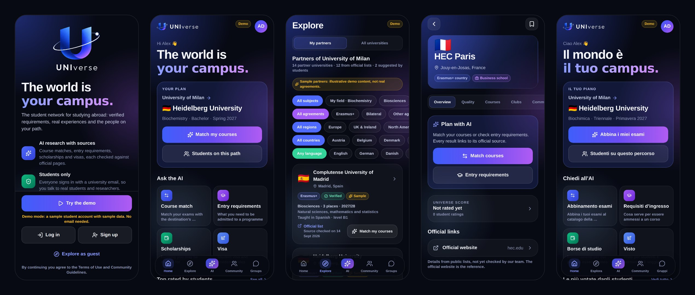

# UNIverse

Mobile app (iOS and Android) for university students and researchers who study abroad: Erasmus+, overseas exchanges or full degrees. The interface is in English, with Italian as a second language.

- **Students only**: sign-in with a university email address (over 10,000 universities recognised by their domain).
- **AI research with sources**: course matching, entry requirements, scholarships and visas; every item cites an official page and anything unconfirmed is flagged.
- **UNIverse score**: ESG and teaching-quality indicators researched by AI (only verified evidence counts) plus ratings from verified students. The best universities are promoted as “Top rated”.
- **Personalised community**: the “For you” feed adapts to each student's courses, research and universities.
- **Groups and channels** (a mix of WhatsApp and Telegram) and **student clubs** with chat.

Built with Expo (React Native + TypeScript), Supabase (database, sign-in, realtime chat, server functions) and the Claude API (web research).



---

## Features

| Feature | How it works |
| --- | --- |
| **Brand** | “U” logo with its orbit (`assets/brand/`), blue → violet palette on a near-black background (`src/theme/tokens.ts`), generated icons and splash. |
| **Language** | English by default, Italian as a second language (`src/i18n/en.ts`, `it.ts`). The app follows the device language and can be switched in *Settings → Language*. AI research reports are written in the app language. |
| **Partner-first search** (*Explore → My partners*) | Search starts from the exchange agreements of the student's home university, with the agreement type (Erasmus+, bilateral, other), then narrows by department or subject area (ISCED-F codes, as in Erasmus+ agreements), region and country (Europe first, then Canada, Australia, other regions, the US last), and language of instruction. Each partner shows where it comes from and when the official source was checked, and opens the AI course match for that destination. Agreements are never invented: they come from an admin import of an official list (verified), from Claude reading the home university's official partner list (`partner-lists` function: only partners on a page it actually opened, matched to the catalogue by Erasmus code, official domain or exact name, shown as “to confirm”), or from students with a link to the official page (shown as “suggested by a student”). Tables: `departments`, `partnerships`, `courses` (linked to departments). |
| **Guests and accounts** | *Explore as guest* opens the catalogue and each university's overview, quality scores and the clubs found on official pages. AI research, posts and comments, equivalences, saving universities, ratings and groups need an account: guests get a friendly log-in / sign-up prompt. The database enforces the same rules (RLS policies for signed-out visitors) and the AI functions answer 401 without a signed-in user. |
| **Premium (coming soon)** | *CV analysis* is visible on the AI tab but locked. There is no payment provider and no analysis yet: `src/lib/premium.ts` holds the feature flag (`EXPO_PUBLIC_FEATURE_CV_ANALYSIS`) and an entitlement-check stub to connect later. |
| **University email sign-in** | 6-digit code by email. The app recognises the university from the domain (including subdomains such as `studenti.unimi.it`) and pre-fills it in the profile. The database also rejects non-university addresses (trigger on `auth.users`), so Gmail, Outlook and similar cannot register. Missing domains go in `email_allowlist`. |
| **AI research** (*AI* tab) | Four kinds: *Course match* (exam by exam against the destination's catalogue), *Entry requirements*, *Scholarships*, *Visa* (US, Asia, UK… and EU free movement). Each report shows numbered sources, the date checked, the academic year, steps, deadlines and warnings. |
| **University quality** | *Quality* tab of each university. ESG (environmental, social, governance) and teaching are researched by Claude from sustainability reports, rankings and official surveys: an indicator counts only if its source was actually opened, and without enough evidence the score stays empty. Students rate 4 aspects (teaching, professors, environment, sustainability); only averages are shown. Score = ESG 35% + teaching 25% + students 40%; below 3 ratings it is “provisional”. “Top rated” = score ≥ 75 and not provisional. |
| **Professors** | To avoid defamation and GDPR risks there are no pages or ratings for individual professors: teaching staff quality is one of the dimensions rated at university level. |
| **“For you” community** | Every search, university viewed or saved and AI research becomes a private signal (with a 2-week decay). The feed ranks posts by destination, saved universities, field of study, course keywords, freshness and engagement, and explains why each post is there (“Your destination”, “You looked at…”). |
| **Groups and channels** | Groups where everyone writes (WhatsApp) and channels where only admins post (Telegram); public (listed in *Discover*) or private (8-character invite code). Realtime messages, unread counts, day separators, report/block/delete. |
| **Student clubs** | *Clubs* tab of each university: ESN sections, associations, sports. Clubs found by AI cite the official page; students can suggest more. Each club has its own chat. |
| **Erasmus and overseas data** | Catalogue of 10,265 universities in 200 countries (*university-domains* list, MIT licence) with email domains, plus Erasmus codes from the European *Erasmus Without Paper* registry when reachable. Worldwide / Erasmus+ / Overseas filter in *Explore*. |

## Structure

```
src/app/                    Screens (Expo Router)
  welcome.tsx, auth.tsx     Welcome and university-email sign-in
  onboarding.tsx            Profile (university already recognised from the email) and destination
  (tabs)/                   Home, Explore, AI, Community, Groups
  university/[id].tsx       Overview, Quality, Courses, Clubs, Community
  research/[id].tsx         AI report with sources and checks
  rate/[id].tsx             University rating
  group/…, club/…           Chat, group info, new group, invite code, clubs
  profile.tsx, settings.tsx, legal/[doc].tsx
src/components/             Design system (ui/) and components
src/data/api/               Data access (Supabase or demo), one file per area
src/data/catalogue.ts       University catalogue bundled with the app
src/i18n/                   English and Italian strings
src/lib/                    Session, language, email recognition, scores, feed ranking
src/legal/documents.ts      DRAFT Terms, Privacy Policy and Guidelines (English and Italian)
scripts/                    University catalogue import and seed generation
supabase/migrations/        Database schema with Row Level Security
supabase/functions/         research, university-insights, partner-lists, delete-account
supabase/tests/             Database tests on in-memory Postgres
```

## Try it now (demo mode)

Without a backend the app uses sample data (labelled “Demo”) and sample AI reports.

```bash
npm install
npx expo start
```

Scan the QR code with **Expo Go**. In demo mode, *Try the demo* signs you in as a sample student; any university email and any 6-digit code also work (try `name@studenti.unimi.it`), and *Explore as guest* shows the signed-out experience.

## Connect the backend

1. **Create a Supabase project** at [supabase.com](https://supabase.com), in an EU region (GDPR).
2. **Database**:
   ```bash
   npx supabase login
   npx supabase link --project-ref <PROJECT-ID>
   npx supabase db push --include-seed
   ```
   The migrations create the tables, access rules (RLS), the university-email check, the score and the groups; the seed loads countries and universities.
3. **Email sign-in**: in *Authentication → Email Templates* add `{{ .Token }}` to the “Magic Link” template (6-digit code) and set the OTP length to 6.
4. **Realtime chat**: already on (the migration adds `group_messages` to the Realtime publication).
5. **Claude API key** (from [console.anthropic.com](https://console.anthropic.com)):
   ```bash
   npx supabase secrets set ANTHROPIC_API_KEY=sk-ant-...
   # optional:
   #   RESEARCH_DAILY_LIMIT=5   AI research requests per student per day
   #   INSIGHTS_DAILY_LIMIT=3   ESG/teaching research per student per day
   #   INSIGHTS_FRESH_DAYS=90   days before an ESG analysis can be refreshed
   #   PARTNERS_FRESH_DAYS=30   days before a partner list can be read again
   #   CLAUDE_MODEL=claude-opus-5
   ```
6. **Server functions**:
   ```bash
   npx supabase functions deploy research
   npx supabase functions deploy university-insights
   npx supabase functions deploy partner-lists
   npx supabase functions deploy delete-account
   ```
   A research run takes 1–3 minutes: the Supabase Free plan stops functions after 150 seconds, so production needs the **Pro plan**.
7. **App**: copy `.env.example` to `.env.local` and fill in the URL and *anon key* (*Settings → API*).

### How the AI agents work

`research` and `university-insights` save the request, reply immediately and keep working in the background; the app refreshes the screen until the report is ready.

- Model `claude-opus-5` with server-side web search and page fetching; if the model declines a request, the API retries it on a fallback model.
- The report is validated against a schema (`schema.ts`); if it is invalid the agent must fix it.
- **Source verification**: every cited URL is compared with the ones actually found or opened during the research. An item is “Official source” only if it rests on an official page that was consulted; otherwise it is “To verify”. ESG needs at least 2 verified indicators and teaching at least 1, otherwise there is no score; clubs without a page that mentions them are dropped.
- Research reports are written in the app language (English or Italian); course titles and quoted requirements stay as the source writes them. ESG and teaching summaries are shared between students and stay in English.
- Identical research is reused for 14 days and ESG analyses for 90; daily limits per student keep costs down (roughly $0.50–2 per research run: measure it with your first users).

### Import partner agreements

Copy an official partner list into a CSV (columns in `scripts/lib/partnerships-csv.mjs`: home and partner university as catalogue id, Erasmus code or web domain, agreement type, official link, and optionally department, ISCED codes, levels, languages, level, places, academic year), then:

```bash
npm run import:partnerships -- agreements.csv > agreements.sql
```

Rows with problems are listed by line and nothing is generated. Review the SQL and run it in the Supabase SQL editor: the agreements are marked verified with today's date, and re-running updates them.

### Update the university catalogue

```bash
npm run import:universities   # downloads the world list + Erasmus registry (if reachable)
npm run gen:seed              # regenerates supabase/seed.sql
npx supabase db push --include-seed
```

Hand-curated entries live in `scripts/data/universities.curated.json` and take precedence.

### Moderation

Posts, comments, messages, groups and clubs can be reported; users can be blocked (required by the App Store). Content reported by 3 people is hidden automatically. Reports must be reviewed within 24 hours:

```sql
select * from reports where status = 'open' order by created_at;
```

## Publish on the App Store

1. **Apple Developer Program** ($99/year) at [developer.apple.com](https://developer.apple.com); a company needs a D-U-N-S number.
2. Check the bundle ID in `app.json` (`com.universeapp.mobile`): it is unique and cannot change after the first release.
3. Connect EAS (builds in the cloud, no Mac needed):
   ```bash
   npx eas-cli login
   npx eas-cli init
   npx eas-cli env:create --environment production --name EXPO_PUBLIC_SUPABASE_URL --value https://... --visibility plaintext
   npx eas-cli env:create --environment production --name EXPO_PUBLIC_SUPABASE_ANON_KEY --value ... --visibility plaintext
   npx eas-cli env:create --environment production --name EXPO_PUBLIC_SUPPORT_EMAIL --value ... --visibility plaintext
   npx eas-cli env:create --environment production --name EXPO_PUBLIC_REVIEW_EMAIL --value ... --visibility plaintext
   ```
4. Build: `npx eas-cli build --platform ios --profile production`.
5. Create the app in [App Store Connect](https://appstoreconnect.apple.com), put its *Apple ID* in `eas.json` (`ascAppId`) and submit: `npx eas-cli submit --platform ios --latest`.
6. Test it with **TestFlight**, then send it for review.

To prepare for Apple review:

- [ ] **Terms, Privacy Policy and Guidelines**: fill in the `[PLACEHOLDER]`s in `src/legal/documents.ts` (English and Italian), have a lawyer review them and publish them on a website.
- [ ] **Support email and URL** (`EXPO_PUBLIC_SUPPORT_EMAIL`).
- [ ] **Reviewer account**: reviewers have no university email and cannot receive codes. Create a password user in Supabase, add its email to `email_allowlist` (`insert into email_allowlist (value, note) values ('review@yourdomain.com', 'App Store review');`), set `EXPO_PUBLIC_REVIEW_EMAIL` and put the email and password in the review notes.
- [ ] **App privacy** in App Store Connect: email, name, user content and product interaction (personalisation), linked to identity, no tracking (as in `privacyManifests` in `app.json`).
- [ ] **Screenshots** for the 6.9" iPhone (1320 × 2868), in English and Italian.
- [ ] **Age rating**: user-generated content and chat, with moderation.
- [ ] **Review notes**: the AI searches public pages only and every result shows its source; the score is an opinion-based indicator, not an official ranking.

For Android: same steps with `--platform android` and a Google Play Console account ($25 one-off).

## Useful commands

```bash
npm run typecheck             # TypeScript for the app, tests and server functions
npm run lint                  # ESLint
npm test                      # scores, feed, partner search, email, translations, imports, AI agents (mocked Claude), database (in-memory Postgres)
npm run import:universities   # updates the university catalogue
npm run gen:seed              # regenerates supabase/seed.sql from the catalogue
npm run import:partnerships   # CSV of official agreements -> SQL
npm run gen:brand             # icons, splash and logo from assets/brand/logo-original.png
```
