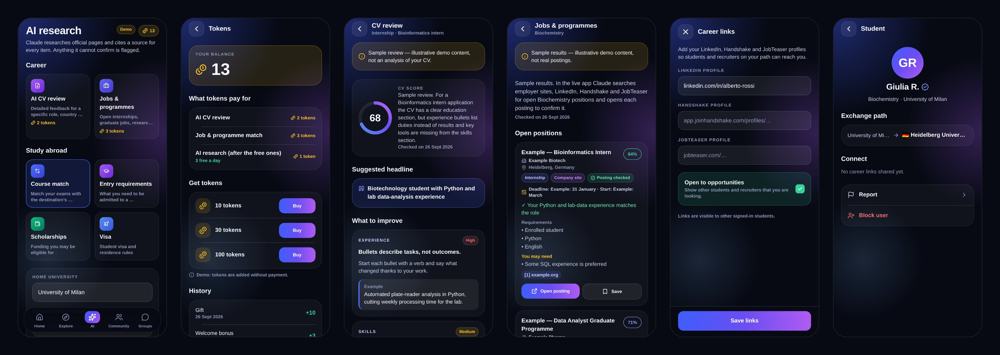

# Universe

App mobile (iOS e Android) per studenti universitari e ricercatori che studiano all'estero — Erasmus+, scambi overseas o lauree complete. L'interfaccia è in inglese.

- **Solo studenti**: si entra solo con l'email universitaria (oltre 10.000 università riconosciute dal dominio).
- **Ricerca AI con fonti**: abbinamento esami, requisiti d'ingresso, borse di studio e visti; ogni voce cita una pagina ufficiale e ciò che non è confermato viene segnalato.
- **UNIVERSE score**: indici ESG e qualità della didattica ricercati dall'AI (conta solo l'evidenza verificata) più i voti degli studenti verificati. Le università migliori vengono promosse come «Top rated».
- **Community personalizzata**: il feed «For you» si adatta a corsi, ricerche e università di ogni studente.
- **Gruppi e canali** (un mix tra WhatsApp e Telegram), **club studenteschi** con chat.
- **Carriera**: revisione del CV con l'AI, ricerca di stage, lavori, posizioni di ricerca e master/PhD adatti allo studente, collegamenti a LinkedIn, Handshake e JobTeaser per networking e recruiting.
- **Token a pagamento** con acquisti in-app (App Store e Google Play) per le funzioni AI più costose.

Costruita con Expo (React Native + TypeScript), Supabase (database, login, chat in tempo reale, funzioni server) e l'API di Claude (ricerca web).




---

## Le funzioni

| Funzione | Come funziona |
| --- | --- |
| **Nuovo brand** | Logo «U» con orbita (`assets/brand/`), palette blu → viola su sfondo quasi nero (`src/theme/tokens.ts`), icone e splash rigenerati. |
| **Login con email universitaria** | Codice a 6 cifre via email. L'app riconosce l'università dal dominio (anche sottodomini come `studenti.unimi.it`) e la precompila nel profilo. Il database rifiuta comunque le email non universitarie (trigger su `auth.users`): Gmail, Outlook ecc. non possono registrarsi. Domini mancanti si aggiungono in `email_allowlist`. |
| **Ricerca AI** (tab *AI*) | Quattro tipi: *Course match* (esame per esame con il catalogo della destinazione), *Entry requirements*, *Scholarships*, *Visa* (USA, Asia, UK… e libera circolazione UE). Ogni report mostra fonti numerate, data di verifica, anno accademico, passaggi, scadenze e avvertenze. |
| **Qualità delle università** | Scheda *Quality* di ogni università. ESG (ambientale, sociale, governance) e didattica sono ricercati da Claude su rapporti di sostenibilità, ranking e sondaggi ufficiali: un indicatore conta solo se la sua fonte è stata davvero aperta, e senza abbastanza evidenza il punteggio resta vuoto. Gli studenti votano 4 aspetti (didattica, docenti, ambiente, sostenibilità); si mostrano solo le medie. Score = ESG 35% + didattica 25% + studenti 40%; sotto i 3 voti è «provvisorio». «Top rated» = score ≥ 75 e non provvisorio. |
| **Docenti** | Per evitare rischi di diffamazione e GDPR non ci sono pagine o voti su singoli professori: la qualità dei docenti è una delle dimensioni votate a livello di università. |
| **Community «For you»** | Ogni ricerca, università visitata o salvata e ricerca AI diventa un segnale privato (con decadimento di 2 settimane). Il feed ordina i post per destinazione, università salvate, area di studio, parole chiave dei corsi, freschezza e interazioni, e spiega perché ogni post è lì («Your destination», «You looked at…»). |
| **Gruppi e canali** | Gruppi dove tutti scrivono (WhatsApp) e canali dove scrivono solo gli admin (Telegram); pubblici (si trovano in *Discover*) o privati (codice invito di 8 caratteri). Messaggi in tempo reale, non letti, separatori per giorno, segnala/blocca/elimina. |
| **Club studenteschi** | Scheda *Clubs* di ogni università: sezioni ESN, associazioni, sport. I club trovati dall'AI citano la pagina ufficiale; gli studenti possono suggerirne altri. Ogni club ha la sua chat. |
| **Token e acquisti in-app** | Le funzioni AI a pagamento costano token: revisione CV 2, ricerca opportunità 3, ricerca AI 1 dopo le 3 gratuite al giorno (prezzi nella tabella `ai_features`, modificabili senza aggiornare l'app). I token si comprano in pacchetti (10, 30, 100) come **acquisti in-app consumabili**: Apple obbliga a usare il suo sistema per crediti digitali (linea guida 3.1.1), e l'utente paga con Apple Pay, carta o credito dell'Apple ID. Ogni nuovo studente riceve 3 token di benvenuto; se un lavoro AI fallisce i token tornano indietro in automatico. Il saldo è un registro che solo il server può scrivere. |
| **Revisione CV** | Lo studente carica il CV in PDF (archivio privato, visibile solo a lui) e sceglie cosa cerca: ruolo, tipo (stage, graduate job, ricerca, master, PhD…), paese e annuncio. Claude restituisce punteggio, titolo di profilo suggerito, miglioramenti per priorità con esempi riscritti senza inventare nulla, controlli per i software di selezione (ATS), parole chiave presenti e mancanti, punteggio per sezione e prossimi passi, secondo le convenzioni del paese e senza giudicare età, genere, nazionalità o aspetto. |
| **Lavori e programmi** | Claude cerca annunci aperti (siti delle aziende, LinkedIn, Handshake, JobTeaser, pagine di laboratori e università) in base a filtri, profilo e, se lo studente vuole, al CV. Apre gli annunci per confermarli: ogni risultato mostra compatibilità, requisiti, lacune, scadenza, piattaforma e link; quelli non aperti sono segnalati. Suggerisce anche aziende e laboratori da seguire. Gli annunci si salvano. |
| **LinkedIn, Handshake, JobTeaser** | Pulsanti per cercare direttamente sulle tre piattaforme, e profili studenti con i propri link e l'indicazione «Open to opportunities» per fare networking. Le API ufficiali di LinkedIn (Talent Solutions), Handshake e JobTeaser sono riservate ai partner: per importare annunci o candidature direttamente serve un accordo con loro (vedi sotto). |
| **Dati Erasmus e overseas** | Catalogo di 10.265 università in 200 paesi (lista *university-domains*, licenza MIT) con i domini email, più codici Erasmus dal registro europeo *Erasmus Without Paper* quando raggiungibile. Filtro Worldwide / Erasmus+ / Overseas in *Explore*. |

## Struttura

```
src/app/                    Schermate (Expo Router)
  welcome.tsx, auth.tsx     Benvenuto e login con email universitaria
  onboarding.tsx            Profilo (università già riconosciuta dall'email) e destinazione
  (tabs)/                   Home, Explore, AI, Community, Groups
  university/[id].tsx       Overview, Quality, Courses, Clubs, Community
  wallet.tsx                Token: saldo, pacchetti, storico
  cv/, opportunities/       Revisione CV e ricerca di lavori/programmi
  user/[id].tsx, career-links.tsx  Profili studenti e link di carriera
  research/[id].tsx         Report AI con fonti e verifiche
  rate/[id].tsx             Voto all'università
  group/…, club/…           Chat, info gruppo, nuovo gruppo, codice invito, club
  profile.tsx, settings.tsx, legal/[doc].tsx
src/components/             Design system (ui/) e componenti
src/data/api/               Accesso ai dati (Supabase o demo), un file per area
src/data/catalogue.ts       Catalogo università incluso nell'app
src/lib/                    Sessione, riconoscimento email, score, ranking del feed
src/legal/documents.ts      BOZZE di Termini, Privacy e Linee guida
scripts/                    Import del catalogo università e generazione del seed
supabase/migrations/        Schema del database con Row Level Security
supabase/functions/         research, university-insights, cv-review, opportunities,
                            revenuecat-webhook, delete-account
supabase/tests/             Test del database su Postgres in memoria
```

## Provarla subito (modalità demo)

Senza backend l'app usa dati di esempio (etichetta «Demo») e report AI dimostrativi.

```bash
npm install
npx expo start
```

Inquadra il QR code con **Expo Go**. In demo qualsiasi email universitaria e qualsiasi codice a 6 cifre funzionano (prova `nome@studenti.unimi.it`).

## Collegare il backend

1. **Crea un progetto Supabase** su [supabase.com](https://supabase.com), in regione UE (GDPR).
2. **Database**:
   ```bash
   npx supabase login
   npx supabase link --project-ref <ID-PROGETTO>
   npx supabase db push --include-seed
   ```
   Le migrazioni creano tabelle, regole di accesso (RLS), il controllo delle email universitarie, lo score e i gruppi; il seed carica paesi e università.
3. **Login via email**: in *Authentication → Email Templates* aggiungi `{{ .Token }}` al template «Magic Link» (codice a 6 cifre) e imposta la lunghezza OTP a 6.
4. **Chat in tempo reale**: già attiva (la migrazione aggiunge `group_messages` alla pubblicazione Realtime).
5. **Chiave dell'API di Claude** (da [console.anthropic.com](https://console.anthropic.com)):
   ```bash
   npx supabase secrets set ANTHROPIC_API_KEY=sk-ant-...
   # opzionali:
   #   RESEARCH_DAILY_LIMIT=5   ricerche AI per studente al giorno
   #   INSIGHTS_DAILY_LIMIT=3   ricerche ESG/didattica per studente al giorno
   #   INSIGHTS_FRESH_DAYS=90   dopo quanti giorni un'analisi ESG può essere rifatta
   #   CLAUDE_MODEL=claude-opus-5
   #   RESEARCH_DAILY_LIMIT=20  tetto giornaliero di ricerche AI per studente (le prime 3 sono gratuite)
   ```
6. **Funzioni server**:
   ```bash
   npx supabase functions deploy research
   npx supabase functions deploy university-insights
   npx supabase functions deploy cv-review
   npx supabase functions deploy opportunities
   npx supabase functions deploy revenuecat-webhook
   npx supabase functions deploy delete-account
   ```
   Una ricerca dura 1–3 minuti: il piano Free di Supabase ferma le funzioni dopo 150 secondi, quindi in produzione serve il **piano Pro**.
7. **App**: copia `.env.example` in `.env.local` e inserisci URL e *anon key* (*Settings → API*).

### Acquisti in-app dei token (RevenueCat)

Gli acquisti funzionano solo in una build vera (TestFlight/App Store o `eas build --profile development`), non in Expo Go.

1. **App Store Connect → la tua app → In-App Purchases**: crea tre acquisti **Consumable** con questi Product ID: `universe_tokens_10`, `universe_tokens_30`, `universe_tokens_100`. Scegli prezzo, nome e descrizione; firma l'accordo *Paid Apps* e inserisci dati bancari e fiscali. Su Google Play Console crea gli stessi ID come prodotti in-app.
2. Crea un progetto su [RevenueCat](https://www.revenuecat.com) (gratuito per iniziare), collega l'app iOS (e Android) e importa i tre prodotti.
3. Copia le **public SDK key** in `EXPO_PUBLIC_REVENUECAT_IOS_KEY` e `EXPO_PUBLIC_REVENUECAT_ANDROID_KEY` (`.env.local` ed EAS).
4. In RevenueCat → *Integrations → Webhooks* aggiungi l'URL `https://<ID-PROGETTO>.supabase.co/functions/v1/revenuecat-webhook` e un valore per l'header *Authorization*, poi salvalo anche come segreto:
   ```bash
   npx supabase secrets set REVENUECAT_WEBHOOK_AUTH=<lo-stesso-valore>
   ```
5. Prova un acquisto con un account *Sandbox* di App Store Connect: i token arrivano in pochi secondi. Anche i revisori Apple comprano in sandbox, e i loro acquisti vengono accreditati normalmente.

I pacchetti e i prezzi in token si cambiano nelle tabelle `token_products` e `ai_features`, senza aggiornare l'app.

### LinkedIn, Handshake e JobTeaser

Oggi l'app usa ciò che è aperto a tutti: l'AI legge gli annunci pubblici, i pulsanti aprono la ricerca sulle piattaforme e gli studenti condividono i propri profili. Per un'integrazione diretta (annunci via API, candidature con un tocco, eventi di recruiting) servono accordi da partner:

- **LinkedIn**: programma *Talent Solutions / Partner Program*.
- **Handshake**: partnership per aziende o università (le API sono riservate ai partner).
- **JobTeaser**: collaborazione con le università che lo usano come career center.

Il codice è pronto ad aggiungere queste fonti: basta una funzione server per ciascuna che scriva gli annunci nello stesso formato di `opportunities`.

### Come lavorano gli agenti AI

`research` e `university-insights` salvano la richiesta, rispondono subito e continuano in background; l'app aggiorna la schermata finché il report è pronto.

- Modello `claude-opus-5` con ricerca web e lettura delle pagine lato server; se il modello rifiuta una richiesta, l'API la ripete su un modello di riserva.
- Il report è validato contro uno schema (`schema.ts`); se non è valido l'agente deve correggerlo.
- **Verifica delle fonti**: ogni URL citato è confrontato con quelli davvero trovati o aperti durante la ricerca. Una voce è «Official source» solo se poggia su una pagina ufficiale consultata; altrimenti è «To verify». Per l'ESG servono almeno 2 indicatori verificati, per la didattica almeno 1, altrimenti niente punteggio; i club senza una pagina che li citi vengono scartati.
- Ricerche identiche sono riusate per 14 giorni, le analisi ESG per 90; limiti giornalieri per studente per contenere i costi (indicativamente 0,50–2 $ a ricerca: misuralo sui primi utenti).
- **Revisione CV**: Claude legge il PDF direttamente (senza ricerca web), quindi costa meno di una ricerca; il CV non viene mai salvato altrove.
- **Lavori e programmi**: un annuncio è «Posting checked» solo se la sua pagina è stata davvero aperta durante la ricerca; la piattaforma (LinkedIn, Handshake, JobTeaser) è ricavata dall'indirizzo, non da ciò che scrive il modello.
- I token vengono scalati prima di iniziare e restituiti se il lavoro fallisce.

### Aggiornare il catalogo università

```bash
npm run import:universities   # scarica la lista mondiale + registro Erasmus (se raggiungibile)
npm run gen:seed              # rigenera supabase/seed.sql
npx supabase db push --include-seed
```

Le voci curate a mano sono in `scripts/data/universities.curated.json` e hanno la precedenza.

### Moderazione

Post, commenti, messaggi, gruppi e club si possono segnalare; gli utenti si possono bloccare (obbligatorio per l'App Store). Un contenuto segnalato da 3 persone viene nascosto automaticamente. Le segnalazioni vanno controllate entro 24 ore:

```sql
select * from reports where status = 'open' order by created_at;
```

## Pubblicare sull'App Store

1. **Apple Developer Program** (99 $/anno) su [developer.apple.com](https://developer.apple.com); per una società serve il D-U-N-S.
2. Controlla il bundle ID in `app.json` (`com.universeapp.mobile`): è unico e non si cambia dopo la prima pubblicazione.
3. Collega EAS (compila nel cloud, non serve un Mac):
   ```bash
   npx eas-cli login
   npx eas-cli init
   npx eas-cli env:create --environment production --name EXPO_PUBLIC_SUPABASE_URL --value https://... --visibility plaintext
   npx eas-cli env:create --environment production --name EXPO_PUBLIC_SUPABASE_ANON_KEY --value ... --visibility plaintext
   npx eas-cli env:create --environment production --name EXPO_PUBLIC_SUPPORT_EMAIL --value ... --visibility plaintext
   npx eas-cli env:create --environment production --name EXPO_PUBLIC_REVIEW_EMAIL --value ... --visibility plaintext
   ```
4. Compila: `npx eas-cli build --platform ios --profile production`.
5. Crea l'app su [App Store Connect](https://appstoreconnect.apple.com), inserisci il suo *Apple ID* in `eas.json` (`ascAppId`) e invia: `npx eas-cli submit --platform ios --latest`.
6. Provala con **TestFlight**, poi inviala in revisione.

Da preparare per la revisione Apple:

- [ ] **Termini, Privacy e Linee guida**: completa i `[PLACEHOLDER]` in `src/legal/documents.ts`, falli rivedere da un legale e pubblicali su un sito.
- [ ] **Email e URL di supporto** (`EXPO_PUBLIC_SUPPORT_EMAIL`).
- [ ] **Acquisti in-app**: prodotti creati e *Ready to Submit*, accordo Paid Apps firmato, e nella schermata *Tokens* i prezzi dello store visibili. Allega i prodotti alla prima versione inviata in revisione.
- [ ] **Account per i revisori**: non hanno un'email universitaria né ricevono i codici. Crea in Supabase un utente con password, aggiungi la sua email a `email_allowlist` (`insert into email_allowlist (value, note) values ('review@tuodominio.com', 'App Store review');`), imposta `EXPO_PUBLIC_REVIEW_EMAIL` e scrivi email e password nelle note per la revisione.
- [ ] **Privacy dell'app** su App Store Connect: email, nome, contenuti degli utenti (anche il CV), interazioni con il prodotto (personalizzazione) e cronologia acquisti, collegati all'identità, nessun tracciamento (come `privacyManifests` in `app.json`).
- [ ] **Screenshot** per iPhone da 6,9" (1320 × 2868).
- [ ] **Classificazione per età**: contenuti generati dagli utenti e chat, con moderazione.
- [ ] **Note per la revisione**: l'AI cerca solo pagine pubbliche e ogni risultato mostra la sua fonte; lo score è un indicatore d'opinione, non un ranking ufficiale.

Per Android: stesso procedimento con `--platform android` e un account Google Play Console (25 $ una tantum).

## Comandi utili

```bash
npm run typecheck             # TypeScript per app, test e funzioni server
npm run lint                  # ESLint
npm test                      # score, feed, email, link, import Erasmus, agenti AI e webhook (simulati), database (Postgres in memoria)
npm run import:universities   # aggiorna il catalogo università
npm run gen:seed              # rigenera supabase/seed.sql dal catalogo
```
